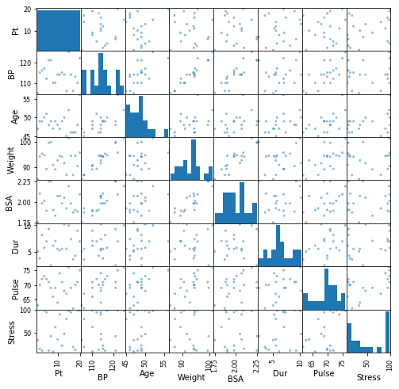
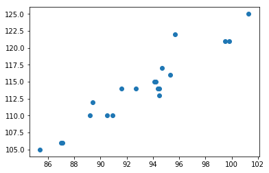

# Correlation, Regression and Multicollinearity


```python
import numpy as np
import pandas as pd
import seaborn as sns
import matplotlib.pyplot as plt
%matplotlib inline
```

As usual start by importing our dataset:


```python
df = pd.read_csv('index.txt', delimiter='\t')
print(len(df), df.columns)
df.head()
```

    20 Index(['Pt', 'BP', 'Age', 'Weight', 'BSA', 'Dur', 'Pulse', 'Stress'], dtype='object')


<div>
<style scoped>
    .dataframe tbody tr th:only-of-type {
        vertical-align: middle;
    }

    .dataframe tbody tr th {
        vertical-align: top;
    }

    .dataframe thead th {
        text-align: right;
    }
</style>
<table border="1" class="dataframe">
  <thead>
    <tr style="text-align: right;">
      <th></th>
      <th>Pt</th>
      <th>BP</th>
      <th>Age</th>
      <th>Weight</th>
      <th>BSA</th>
      <th>Dur</th>
      <th>Pulse</th>
      <th>Stress</th>
    </tr>
  </thead>
  <tbody>
    <tr>
      <th>0</th>
      <td>1</td>
      <td>105</td>
      <td>47</td>
      <td>85.4</td>
      <td>1.75</td>
      <td>5.1</td>
      <td>63</td>
      <td>33</td>
    </tr>
    <tr>
      <th>1</th>
      <td>2</td>
      <td>115</td>
      <td>49</td>
      <td>94.2</td>
      <td>2.10</td>
      <td>3.8</td>
      <td>70</td>
      <td>14</td>
    </tr>
    <tr>
      <th>2</th>
      <td>3</td>
      <td>116</td>
      <td>49</td>
      <td>95.3</td>
      <td>1.98</td>
      <td>8.2</td>
      <td>72</td>
      <td>10</td>
    </tr>
    <tr>
      <th>3</th>
      <td>4</td>
      <td>117</td>
      <td>50</td>
      <td>94.7</td>
      <td>2.01</td>
      <td>5.8</td>
      <td>73</td>
      <td>99</td>
    </tr>
    <tr>
      <th>4</th>
      <td>5</td>
      <td>112</td>
      <td>51</td>
      <td>89.4</td>
      <td>1.89</td>
      <td>7.0</td>
      <td>72</td>
      <td>95</td>
    </tr>
  </tbody>
</table>
</div>


```python
pd.plotting.scatter_matrix(df, figsize=(8,8))
```


    array([[<matplotlib.axes._subplots.AxesSubplot object at 0x1a30acfa90>,
            <matplotlib.axes._subplots.AxesSubplot object at 0x1a30b26390>,
            <matplotlib.axes._subplots.AxesSubplot object at 0x1a30b50860>,
            <matplotlib.axes._subplots.AxesSubplot object at 0x1a30b66b70>,
            <matplotlib.axes._subplots.AxesSubplot object at 0x1a30b88e80>,
            <matplotlib.axes._subplots.AxesSubplot object at 0x1a30b88eb8>,
            <matplotlib.axes._subplots.AxesSubplot object at 0x1a30bd5ac8>,
            <matplotlib.axes._subplots.AxesSubplot object at 0x1a30c0a198>],
           [<matplotlib.axes._subplots.AxesSubplot object at 0x1a30c30828>,
            <matplotlib.axes._subplots.AxesSubplot object at 0x1a30c5aeb8>,
            <matplotlib.axes._subplots.AxesSubplot object at 0x1a30c8a588>,
            <matplotlib.axes._subplots.AxesSubplot object at 0x1a30cb2c18>,
            <matplotlib.axes._subplots.AxesSubplot object at 0x1a30ce42e8>,
            <matplotlib.axes._subplots.AxesSubplot object at 0x1a30d0a978>,
            <matplotlib.axes._subplots.AxesSubplot object at 0x1a30d3f048>,
            <matplotlib.axes._subplots.AxesSubplot object at 0x1a30d656d8>],
           [<matplotlib.axes._subplots.AxesSubplot object at 0x1a30d8fd68>,
            <matplotlib.axes._subplots.AxesSubplot object at 0x1a30dc0438>,
            <matplotlib.axes._subplots.AxesSubplot object at 0x1a30de7ac8>,
            <matplotlib.axes._subplots.AxesSubplot object at 0x1a30e1a198>,
            <matplotlib.axes._subplots.AxesSubplot object at 0x1a30e41828>,
            <matplotlib.axes._subplots.AxesSubplot object at 0x1a30e6beb8>,
            <matplotlib.axes._subplots.AxesSubplot object at 0x1a30e9c588>,
            <matplotlib.axes._subplots.AxesSubplot object at 0x1a30ec3c18>],
           [<matplotlib.axes._subplots.AxesSubplot object at 0x1a30ef52e8>,
            <matplotlib.axes._subplots.AxesSubplot object at 0x1a30f1e978>,
            <matplotlib.axes._subplots.AxesSubplot object at 0x1a30f4e048>,
            <matplotlib.axes._subplots.AxesSubplot object at 0x1a30f766d8>,
            <matplotlib.axes._subplots.AxesSubplot object at 0x1a30fa0d68>,
            <matplotlib.axes._subplots.AxesSubplot object at 0x1a30fd1438>,
            <matplotlib.axes._subplots.AxesSubplot object at 0x1a30ff8ac8>,
            <matplotlib.axes._subplots.AxesSubplot object at 0x1a3102d198>],
           [<matplotlib.axes._subplots.AxesSubplot object at 0x1a31054828>,
            <matplotlib.axes._subplots.AxesSubplot object at 0x1a3107feb8>,
            <matplotlib.axes._subplots.AxesSubplot object at 0x1a310af588>,
            <matplotlib.axes._subplots.AxesSubplot object at 0x1a310d5c18>,
            <matplotlib.axes._subplots.AxesSubplot object at 0x1a311072e8>,
            <matplotlib.axes._subplots.AxesSubplot object at 0x1a3112d978>,
            <matplotlib.axes._subplots.AxesSubplot object at 0x1a31161048>,
            <matplotlib.axes._subplots.AxesSubplot object at 0x1a3118a6d8>],
           [<matplotlib.axes._subplots.AxesSubplot object at 0x1a311b3d68>,
            <matplotlib.axes._subplots.AxesSubplot object at 0x1a311dbe10>,
            <matplotlib.axes._subplots.AxesSubplot object at 0x1a3120b4e0>,
            <matplotlib.axes._subplots.AxesSubplot object at 0x1a31233b70>,
            <matplotlib.axes._subplots.AxesSubplot object at 0x1a31267240>,
            <matplotlib.axes._subplots.AxesSubplot object at 0x1a3128d8d0>,
            <matplotlib.axes._subplots.AxesSubplot object at 0x1a312b8f60>,
            <matplotlib.axes._subplots.AxesSubplot object at 0x1a312ea630>],
           [<matplotlib.axes._subplots.AxesSubplot object at 0x1a31311cc0>,
            <matplotlib.axes._subplots.AxesSubplot object at 0x1a31341390>,
            <matplotlib.axes._subplots.AxesSubplot object at 0x1a3136ba20>,
            <matplotlib.axes._subplots.AxesSubplot object at 0x1a3139c0f0>,
            <matplotlib.axes._subplots.AxesSubplot object at 0x1a313c4780>,
            <matplotlib.axes._subplots.AxesSubplot object at 0x1a313eee10>,
            <matplotlib.axes._subplots.AxesSubplot object at 0x1a314204e0>,
            <matplotlib.axes._subplots.AxesSubplot object at 0x1a31447b70>],
           [<matplotlib.axes._subplots.AxesSubplot object at 0x1a3147b240>,
            <matplotlib.axes._subplots.AxesSubplot object at 0x1a314a28d0>,
            <matplotlib.axes._subplots.AxesSubplot object at 0x1a314cbf60>,
            <matplotlib.axes._subplots.AxesSubplot object at 0x1a314fb630>,
            <matplotlib.axes._subplots.AxesSubplot object at 0x1a31523cc0>,
            <matplotlib.axes._subplots.AxesSubplot object at 0x1a31557390>,
            <matplotlib.axes._subplots.AxesSubplot object at 0x1a3157ea20>,
            <matplotlib.axes._subplots.AxesSubplot object at 0x1a315b00f0>]],
          dtype=object)





## Correlation
As we can see, there's quite a bit of correlated features here!  
We can also further investigate a single relationship between two variables with the **plt.scatter(x,y)** method or calculte the pearson correlation coefficient with numpy's built in **np.corrcoeff()** method:


```python
x , y = df.Weight, df.BP
print(np.corrcoef(x,y))
plt.scatter(x,y)
```

    [[1.         0.95006765]
     [0.95006765 1.        ]]


    <matplotlib.collections.PathCollection at 0x1a3171cb00>





## Correlation versus causation
As you may have heard before, correlation does not equal causation. One fun example of this is ice cream sales and shark attacks. We have a bizarre dataset recording ice cream sales and shark attacks on given days at various beach towns, and plotting the two we notice a distinct correlation between the two. This does not mean that more ice sales causes more shark attacks to happen. In this case, both variables (ice cream sales and shark attacks) are correlated with a third feature we have yet to examine: temperature. In summer, as the temperature rises, both ice cream sales and shark attacks increase while in winter, there are comparitively few of both. In sum, don't assume that just because two variables are correlated that there is any direct causal relation between the two.

## Multicollinearity
Multicollinearity is when we have multiple predictive variables which are highly correlated. This leads to a number of issues when we then go to perform regression (which we will investigate in more depth!) 

In our current example, Blood Pressure and Weight were highly correlated which will greatly impact our regression analysis. Let's investigate this briefly.

# Regression


```python
from sklearn.linear_model import LinearRegression

#Define X and y
X = df[['Pt', 'Age', 'Weight', 'BSA', 'Dur', 'Pulse', 'Stress']]
y = df['BP']
#Initialize a regression object
linreg = LinearRegression()

#Fit the model
linreg.fit(X, y)

#Use the model to predict outputs
df['Estimated BP'] = linreg.predict(X)

#Calculate Errors (also called residuals)
df['Residuals'] = df['Estimated BP'] - df['BP']

#Print the model's R^2 to measure overall performance
print('R^2 model score:', linreg.score(X,y), '\n')

#Print the coefficients for the model's formula
print('Model feature coefficients:')
weight_dict = dict(zip(X.columns, linreg.coef_))
for feat, coeff in list(zip(X.columns, linreg.coef_)):
    print(feat, 'Coefficient weight: {}'.format(round(coeff, 4)))
```

    R^2 model score: 0.9962701462782667 
    
    Model feature coefficients:
    Pt Coefficient weight: -0.011
    Age Coefficient weight: 0.7018
    Weight Coefficient weight: 0.9778
    BSA Coefficient weight: 3.6165
    Dur Coefficient weight: 0.072
    Pulse Coefficient weight: -0.0902
    Stress Coefficient weight: 0.0064


# Problems with multicollinearity
There are a few considerations to keep in mind when it comes to interpreting regression models based on underlying data with multicollinearity. *One is that the coefficients in the model themselves lose interpretability.* Under ideal conditions, we would like to interpret our coefficients literally. For example, the coefficient associated with weight is 0.9778. If this coefficient were stable, we could say something along the lines "as a person's weight goes up by 1, there blood pressure goes up by 0.9778. Unfortunately, with multicollinearity, we cannot make such claims. That is because the coefficients associated with weights that are highly correlated may vary widely. For example, observe what happens to the coefficient associated with weight when we remove the highly correlated feature BSA:


```python
from sklearn.linear_model import LinearRegression

#Define X and y
X = df[['Pt', 'Age', 'Weight', 'Dur', 'Pulse', 'Stress']] #'BSA' removed.
y = df['BP']
#Initialize a regression object
linreg = LinearRegression()

#Fit the model
linreg.fit(X, y)

#Use the model to predict outputs
df['Estimated BP'] = linreg.predict(X)

#Calculate Errors (also called residuals)
df['Residuals'] = df['Estimated BP'] - df['BP']

#Print the model's R^2 to measure overall performance
print('R^2 model score:', linreg.score(X,y), '\n')

#Save results
new_weight_dict = dict(zip(X.columns, linreg.coef_))

#Print the coefficients for the model's formula
print('Model feature coefficients:')
for feat, coeff in list(zip(X.columns, linreg.coef_)):
    print(feat, 'Coefficient weight: {}'.format(round(coeff, 4)))

```

    R^2 model score: 0.9947573091859482 
    
    Model feature coefficients:
    Pt Coefficient weight: -0.0172
    Age Coefficient weight: 0.7278
    Weight Coefficient weight: 1.1027
    Dur Coefficient weight: 0.07
    Pulse Coefficient weight: -0.1428
    Stress Coefficient weight: 0.0086


```python
weights = pd.DataFrame.from_dict(weight_dict, orient='index').reset_index()
weights.columns = ['Feature', 'Original Weight']
weights['New Weight'] = weights.Feature.map(new_weight_dict)
weights['Change'] = np.abs(weights['New Weight'] - weights['Original Weight']) #Net change (absolute value)
weights = weights.sort_values(by='Change', ascending=False)
weights['BSA Corr'] = weights.Feature.map(lambda feat: np.corrcoef(df.BSA, df[feat])[0][1])
weights
```


<div>
<style scoped>
    .dataframe tbody tr th:only-of-type {
        vertical-align: middle;
    }

    .dataframe tbody tr th {
        vertical-align: top;
    }

    .dataframe thead th {
        text-align: right;
    }
</style>
<table border="1" class="dataframe">
  <thead>
    <tr style="text-align: right;">
      <th></th>
      <th>Feature</th>
      <th>Original Weight</th>
      <th>New Weight</th>
      <th>Change</th>
      <th>BSA Corr</th>
    </tr>
  </thead>
  <tbody>
    <tr>
      <th>2</th>
      <td>Weight</td>
      <td>0.977808</td>
      <td>1.102730</td>
      <td>0.124922</td>
      <td>0.875305</td>
    </tr>
    <tr>
      <th>5</th>
      <td>Pulse</td>
      <td>-0.090189</td>
      <td>-0.142836</td>
      <td>0.052647</td>
      <td>0.464819</td>
    </tr>
    <tr>
      <th>1</th>
      <td>Age</td>
      <td>0.701830</td>
      <td>0.727818</td>
      <td>0.025989</td>
      <td>0.378455</td>
    </tr>
    <tr>
      <th>0</th>
      <td>Pt</td>
      <td>-0.011031</td>
      <td>-0.017190</td>
      <td>0.006159</td>
      <td>-0.031288</td>
    </tr>
    <tr>
      <th>6</th>
      <td>Stress</td>
      <td>0.006422</td>
      <td>0.008632</td>
      <td>0.002210</td>
      <td>0.018446</td>
    </tr>
    <tr>
      <th>4</th>
      <td>Dur</td>
      <td>0.071956</td>
      <td>0.069955</td>
      <td>0.002000</td>
      <td>0.130540</td>
    </tr>
    <tr>
      <th>3</th>
      <td>BSA</td>
      <td>3.616457</td>
      <td>NaN</td>
      <td>NaN</td>
      <td>1.000000</td>
    </tr>
  </tbody>
</table>
</div>


What this goes to demonstrate is that some of these coefficients are unstable and depend on what other features are incorporated into the model. Adding additional features that are correlated with features already added will never reduce the overall performance of the model, but can be thought of as 'not adding much new information'. In this way, adding correlated features is unlikely to drastically increase model performance to any substantial degree. This also makes it difficult to judge the importance of a particular variable; the importance of the variable depends on what variables are already present (if other variables already exist which are highly correlated, then the variable will again add little predictive information).

# Try it
Iterate through the remaining columns and successively remove features from the model. Record what happens to the R^2 of the model and the various coefficients.


```python
#Your code here
```

# Normalization
Another important factor can be the scale of your various features. Simply having one feature that is on a much larger scale then others can bloat its signifigance to some training algorithms. For example, the weight feature has a much larger numerical scale then the BSA feature column. To standardize this, a common technique is to normalize all columns to have a minimum of zero and a maximum on one. An easy way to do this is:  
$\frac{value - minimum}{maximum - minimum}$


```python
df = pd.read_csv('index.txt', delimiter='\t')
print(len(df), df.columns)
df.head()
```

    20 Index(['Pt', 'BP', 'Age', 'Weight', 'BSA', 'Dur', 'Pulse', 'Stress'], dtype='object')


<div>
<style scoped>
    .dataframe tbody tr th:only-of-type {
        vertical-align: middle;
    }

    .dataframe tbody tr th {
        vertical-align: top;
    }

    .dataframe thead th {
        text-align: right;
    }
</style>
<table border="1" class="dataframe">
  <thead>
    <tr style="text-align: right;">
      <th></th>
      <th>Pt</th>
      <th>BP</th>
      <th>Age</th>
      <th>Weight</th>
      <th>BSA</th>
      <th>Dur</th>
      <th>Pulse</th>
      <th>Stress</th>
    </tr>
  </thead>
  <tbody>
    <tr>
      <th>0</th>
      <td>1</td>
      <td>105</td>
      <td>47</td>
      <td>85.4</td>
      <td>1.75</td>
      <td>5.1</td>
      <td>63</td>
      <td>33</td>
    </tr>
    <tr>
      <th>1</th>
      <td>2</td>
      <td>115</td>
      <td>49</td>
      <td>94.2</td>
      <td>2.10</td>
      <td>3.8</td>
      <td>70</td>
      <td>14</td>
    </tr>
    <tr>
      <th>2</th>
      <td>3</td>
      <td>116</td>
      <td>49</td>
      <td>95.3</td>
      <td>1.98</td>
      <td>8.2</td>
      <td>72</td>
      <td>10</td>
    </tr>
    <tr>
      <th>3</th>
      <td>4</td>
      <td>117</td>
      <td>50</td>
      <td>94.7</td>
      <td>2.01</td>
      <td>5.8</td>
      <td>73</td>
      <td>99</td>
    </tr>
    <tr>
      <th>4</th>
      <td>5</td>
      <td>112</td>
      <td>51</td>
      <td>89.4</td>
      <td>1.89</td>
      <td>7.0</td>
      <td>72</td>
      <td>95</td>
    </tr>
  </tbody>
</table>
</div>


# Try it out!
Iterate over the columns and normalize each to have a minimum of zero and maximum of one by applying a lambda function that subtracts the minimum and divides by the range.  
$\frac{value - minimum}{maximum - minimum}$


```python
#Your code here
```
